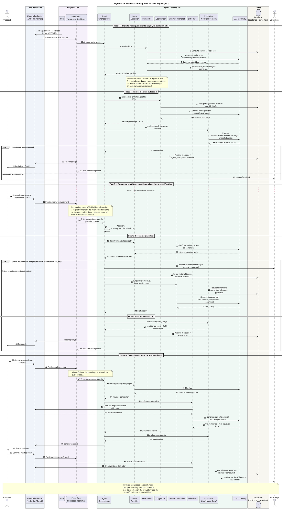
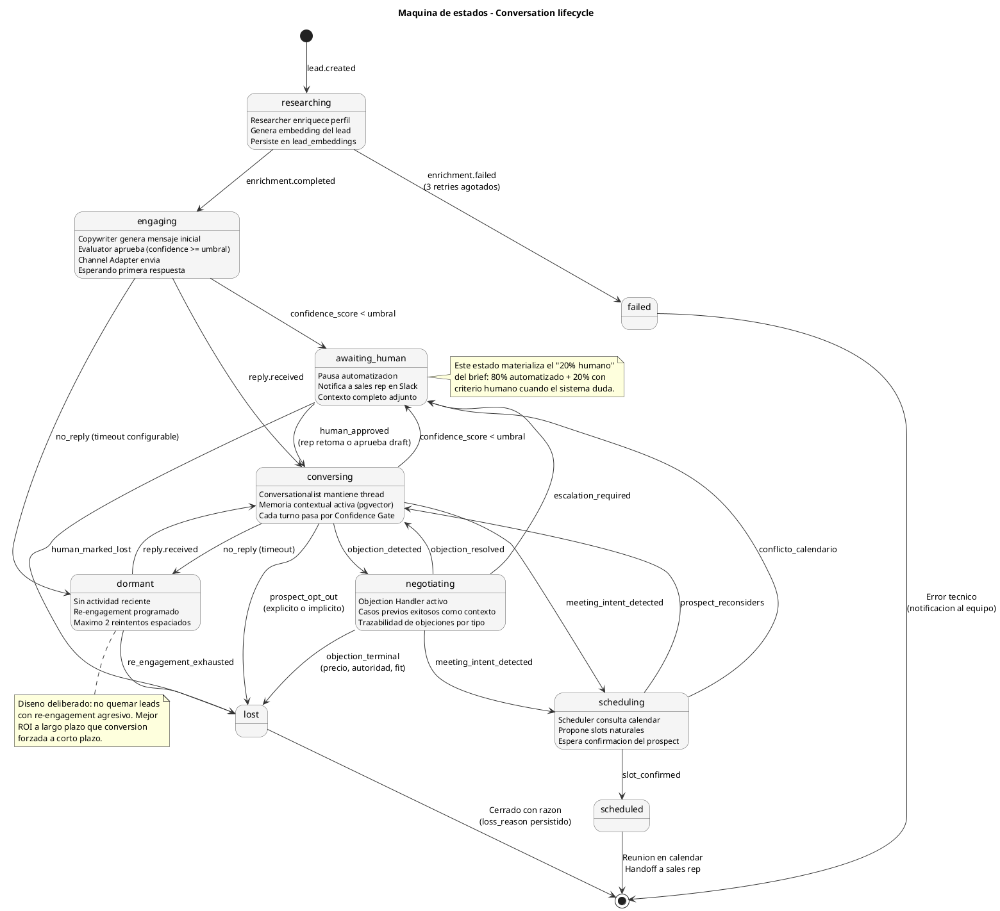

# Arquitectura — Zolvo AI Sales & Growth Engine

**Propuesta técnica · Coding Fellowship · Makers Admission 2026-2**

**Autor:** Stiven Yepes Vanegas
**Versión:** 0.2 (revisión arquitectónica aplicada — pendiente prototipo)
**Última actualización:** 23 de mayo de 2026

---

## 1. Contexto del reto

Zolvo opera un *AI Sales & Growth Engine* que automatiza outbound marketing y cierre inicial de ventas: identifica leads, envía mensajes personalizados vía LinkedIn/Email y agenda reuniones sin intervención humana. El reto consiste en diseñar la arquitectura técnica del sistema para lanzarlo en un nuevo mercado (México), demostrando cómo automatizar el 80% del proceso de ventas y marketing con ROI claro para el cliente.

**Mercado objetivo:** México. Razones: mismo idioma, compliance manejable (LFPDPPP), ecosistema fintech B2B activo (Konfío, Klar, Stori, Kueski) que constituye ICP natural para Zolvo.

**Restricciones explícitas del brief:**
- Uso de herramientas tipo `n8n` o `Cursor AI` como orquestador visible.
- Pipeline conectando `n8n` + `Supabase` + `LLMs`.
- Agentes con respuestas indistinguibles de un humano (requisito, no propuesta de valor).
- Arquitectura escalable.

---

## 2. Objetivo del sistema

> *Automatizar el 80% del proceso de ventas y marketing outbound, garantizando ROI medible y mantenibilidad del sistema en producción.*

Tres sub-objetivos derivados:

1. **80% automatizado:** el sistema opera autónomamente en el camino feliz y escala a humano cuando duda. El 20% restante no es un bug, es diseño.
2. **ROI claro:** cada agente registra costo, latencia y resultado. Métricas como `cost_per_meeting_booked` se calculan con una query.
3. **Indistinguible de humano:** memoria contextual, timing variable, evaluación previa al envío, manejo de objeciones, escalamiento ante incertidumbre.

---

## 3. Atributos de calidad priorizados

El sistema se diseña optimizando explícitamente los siguientes atributos, en orden de prioridad:

| # | Atributo | Cómo sirve al objetivo |
|---|---|---|
| 1 | **Modularidad / agnosticismo** | Strategy pattern para LLMs habilita routing por costo (reducción estimada del 60-70% en gasto de tokens). |
| 2 | **Observabilidad** | Sin métricas no hay ROI demostrable. Toda decisión de agente queda trazable. |
| 3 | **Confiabilidad** | Retries, dead letter queues, fallbacks. Un sistema que falla y requiere rescate humano no es 80% automatizado. |
| 4 | **Escalabilidad** | Event-driven, async, sin acoplamiento síncrono. 50 → 5000 leads/día sin re-arquitectura. |
| 5 | **Seguridad** | RLS multi-tenant, secrets management, guardrails en outputs de LLM, compliance LFPDPPP/GDPR. |
| 6 | **Mantenibilidad / testeabilidad** | Consecuencia de los anteriores: interfaces claras facilitan tests unitarios y mocks. |

**Atributos NO priorizados explícitamente** (decisión consciente, no negligencia):
- *Performance de baja latencia:* outbound es asíncrono por naturaleza, segundos vs. milisegundos no importan aquí.
- *Disponibilidad 99.99%:* tolerable degradación temporal mientras se preserven los eventos.

---

## 4. Estilo arquitectónico

**Event-driven con orquestación híbrida** (n8n + microservicios Python).

Justificación: outbound es asíncrono por naturaleza (días entre mensajes, respuestas impredecibles). Un modelo request-response síncrono no encaja con el dominio.

### 4.1 División de responsabilidades: ¿por qué no todo en n8n?

El brief pide explícitamente usar n8n. Esto puede interpretarse de dos formas:

- **Camino A — todo en n8n:** usar AI nodes y LangChain integrado para construir la lógica de agentes directamente en nodos de n8n.
- **Camino B — híbrido:** n8n como capa de integración de canales y workflows visibles; servicios Python para la lógica compleja.

**Esta arquitectura adopta el Camino B explícitamente, no por evadir n8n, sino para preservar atributos de calidad críticos:**

| Atributo | Camino A (todo n8n) | Camino B (híbrido) |
|---|---|---|
| Testeabilidad | Casi imposible — lógica en JSON | Tests unitarios e integración estándar |
| Mantenibilidad | Lógica vive en nodos sin versionado real | Código en Git, code review normal |
| Modularidad (Strategy pattern) | Limitada por abstracciones de n8n | Implementación natural en Python |
| Cumplimiento del brief | ✅ literal | ✅ usa n8n como pide, sin encerrarse |
| Visibilidad para sales rep | ✅ excelente | ✅ los workflows visibles siguen en n8n |
| Lock-in tecnológico | Alto (toda la lógica acoplada) | Bajo (n8n reemplazable sin tocar agentes) |

**Lo que sí hace n8n** (su trabajo pesado, no es "pasamanos"):
- Triggers programados (re-engagement de leads en estado `dormant`)
- Integraciones con LinkedIn, Email, Calendar (OAuth, rate limiting, retries)
- Workflows visibles para sales reps (UI nativa de n8n)
- Webhooks de entrada y outbox de eventos
- Schedule de envíos respetando ventanas horarias del prospect

**Lo que hace Python:**
- Lógica multi-agente con Strategy pattern
- LLM Gateway con routing por costo
- Intent Classifier + Confidence Gate
- Memoria contextual con pgvector
- Procesamiento serial con debouncing

### 4.2 Patrones aplicados

- *Strategy* — abstracción de proveedores de LLM y canales.
- *Repository* — acceso a datos desacoplado de la lógica de negocio.
- *Outbox pattern* — entrega confiable de eventos sin acoplar transacciones a brokers externos.
- *Pipes & filters* — pipeline de procesamiento de mensajes (classify → generate → evaluate → send).
- *Circuit breaker* — protección ante caídas de proveedores LLM o canales.
- *Debouncing + advisory lock* — procesamiento serial garantizado por lead (ver ADR-06).

---

## 5. Decisiones arquitectónicas (ADRs)

### ADR-01 · n8n como orquestador visible, agentes como microservicios Python

**Contexto:** el brief pide explícitamente `n8n` o `Cursor AI`. Implementar toda la lógica en nodos de n8n vuelve el sistema inmantenible (lógica en JSON, sin tests, sin versionado real).

**Decisión:** n8n maneja los workflows visibles (entrada de leads, programación de mensajes, triggers temporales, integraciones con canales) y delega vía HTTP a servicios Python desacoplados donde reside la lógica de agentes y evaluación.

**Consecuencias:**
- ✅ Cumplimiento explícito del brief.
- ✅ Lógica compleja queda testeable y versionable.
- ✅ Visibilidad operativa para sales reps via UI de n8n.
- ⚠️ Dos sistemas que mantener (operacionalmente más complejo).

---

### ADR-02 · Strategy pattern para proveedor de LLM con routing por costo/criticidad

**Contexto:** los LLMs son commodity, sus precios y capacidades cambian mensualmente. Acoplarse a un solo proveedor es deuda técnica garantizada.

**Decisión:** una interfaz `LLMProvider` con implementaciones para OpenAI, Anthropic, Ollama y OpenRouter. Cada agente recibe el provider por inyección. Un router decide el modelo según el tipo de tarea: modelos baratos para clasificación y evaluación, modelos premium para generación crítica.

**Consecuencias:**
- ✅ Reducción de costos del 60-70% vs. usar modelo premium para todo.
- ✅ Migración entre proveedores sin tocar lógica de negocio.
- ✅ Habilita uso de modelos locales (Ollama) para tareas sensibles a PII.
- ⚠️ Complejidad adicional en pruebas (mocks obligatorios).

---

### ADR-03 · Event-driven con Supabase Realtime + outbox pattern

**Contexto:** las conversaciones outbound son asíncronas. Esperar horas o días entre turnos es la norma. Un modelo síncrono fuerza polling o bloqueos.

**Decisión:** eventos de dominio (`lead.created`, `message.sent`, `reply.received`, `meeting.booked`, `escalation.required`) publicados via Supabase Realtime. Para eventos críticos se aplica outbox pattern: el evento se escribe en la misma transacción que el cambio de estado y un worker lo publica después.

**Consecuencias:**
- ✅ Sin polling, sin bloqueos.
- ✅ Entrega confiable de eventos (at-least-once).
- ✅ Escalabilidad horizontal natural.
- ⚠️ Debugging de flujos distribuidos requiere observabilidad fuerte (mitigado por ADR-04).

---

### ADR-04 · Pipeline de dos puertas: Intent Classifier + Confidence Gate

**Contexto:** ningún sistema autónomo es 100% confiable. Pretenderlo es ingenuo y operativamente peligroso (un agente quemando leads por una alucinación cuesta más que cualquier ahorro). Confiar únicamente en el "low confidence" del generador es insuficiente: los LLMs tienden a sobre-confiar y alucinar antes que admitir incertidumbre.

**Decisión:** dos puertas independientes en el pipeline.

**Puerta 1 — Intent Classifier (antes de generar):** un clasificador rápido y barato (Haiku, Llama-3.1-8B o equivalente) lee el mensaje entrante y lo categoriza en un set predefinido: `interested`, `objection_price`, `objection_authority`, `objection_timing`, `meeting_intent`, `complaint`, `complex_technical`, `out_of_scope`, `opt_out`. Categorías sensibles (`complaint`, `complex_technical`, `out_of_scope`, `opt_out`) hacen **handoff directo a humano sin pasar por generación**. Esto previene que el agente intente responder algo para lo que no debería.

**Puerta 2 — Confidence Gate (después de generar):** para mensajes que sí pasan a generación, el output se evalúa antes de enviar. Otro LLM (modelo barato) puntúa el `confidence_score` en los ejes de naturalidad, relevancia y riesgo. Si baja del umbral configurable, escala a humano vía Slack con contexto completo.

**Consecuencias:**
- ✅ Operacionaliza el 80% del brief con doble salvaguarda.
- ✅ Reduce alucinaciones: lo que no debería responderse, no se intenta responder.
- ✅ Cada decisión queda auditable (tanto la clasificación como la evaluación).
- ✅ Genera dataset etiquetado para fine-tuning futuro.
- ⚠️ 2 llamadas LLM extra por mensaje entrante (~$0.002 con modelos baratos). Costo trivial frente al riesgo evitado.

---

### ADR-05 · Multi-tenant desde el día uno con Row-Level Security

**Contexto:** Zolvo es B2B. Múltiples clientes comparten la infraestructura. Una fuga entre tenants sería catastrófica.

**Decisión:** todas las tablas operacionales llevan `tenant_id`. Políticas de RLS en Postgres garantizan aislamiento a nivel de fila. La aplicación nunca filtra por `tenant_id` manualmente — depende de RLS + contexto de sesión.

**Consecuencias:**
- ✅ Aislamiento garantizado a nivel de base de datos, no de aplicación.
- ✅ Cumplimiento LFPDPPP/GDPR (derecho al olvido vía RLS y soft-deletes).
- ⚠️ Performance: índices con `tenant_id` como primer campo son obligatorios.

---

### ADR-06 · Procesamiento serial por lead con debouncing y advisory lock

**Contexto:** un prospect puede enviar mensajes rápidos seguidos ("Hola", 3 segundos después "Me interesa, ¿precios?"). Si el sistema procesa en paralelo, dos agentes leen historial incompleto y envían respuestas desincronizadas. Nada delata más a un bot que esto. Adicionalmente, respuestas instantáneas (< 5 segundos) también delatan al bot: un humano leyendo LinkedIn no responde en 2 segundos.

**Decisión:** combinar dos mecanismos.

1. **Debouncing en ingesta:** cuando llega un mensaje, el sistema espera entre 30 y 90 segundos (jitter aleatorio, configurable por canal y horario) antes de procesarlo. Si llega otro mensaje del mismo lead durante ese tiempo, el timer se reinicia y los mensajes se agrupan como un solo turno conversacional.

2. **Advisory lock en procesamiento:** antes de procesar un turno, el worker adquiere un `pg_advisory_xact_lock(lead_id)` en Postgres. Esto garantiza procesamiento serial estricto por lead, incluso si múltiples workers compiten por el mismo evento.

**Consecuencias:**
- ✅ Elimina race conditions en mensajes concurrentes del mismo lead.
- ✅ La latencia "natural" deja de ser bug y se convierte en feature de humanización.
- ✅ Reduce costo: mensajes agrupados = una sola llamada LLM en vez de N.
- ⚠️ Aumenta latencia de respuesta — aceptable y deseable en outbound asíncrono.
- ⚠️ Requiere monitoreo: si el debouncing se desboca, el sistema responde lento sin justificación.

---

### ADR-07 · Estrategia de memoria dual: contexto inmediato + memoria semántica

**Contexto:** la "memoria" de un agente conversacional tiene dos necesidades distintas que se confunden frecuentemente: el contexto inmediato del thread actual (qué se dijo hace 2 mensajes) y la memoria semántica de largo plazo (qué objeciones similares se resolvieron en otros leads, qué dijo este mismo lead hace 3 semanas).

Resolver ambas con el mismo mecanismo es subóptimo: vectorizar el thread actual es costoso e innecesario; cargar todo el historial textual es imposible más allá de cierto volumen.

**Decisión:** estrategia dual.

**Memoria de corto plazo (textual):** los últimos N mensajes de la conversación actual se cargan textuales desde la tabla `messages` y se inyectan al prompt como `chat_history`. N es configurable (típicamente 10-20 turnos). No se vectoriza. Acceso O(1) por `conversation_id`.

**Memoria de largo plazo (semántica):** conversaciones cerradas, casos exitosos de objeciones, perfiles de leads similares e ICP — todo vive como embeddings en `lead_embeddings` y una tabla nueva `conversation_summaries_embeddings`. El agente consulta vía similarity search (pgvector) cuando necesita contexto que no está en la ventana inmediata.

**Consecuencias:**
- ✅ Eficiencia: no vectorizamos lo que no necesita búsqueda semántica.
- ✅ Calidad: el agente tiene contexto preciso reciente + contexto relevante histórico.
- ✅ Costo controlado: embeddings se generan al cerrar conversaciones, no en cada turno.
- ⚠️ Complejidad: dos mecanismos de memoria en lugar de uno. Mitigado encapsulando ambos en `MemoryService` con una interfaz unificada.

---

## 6. Diagramas C4

### 6.1 Nivel 1 — Contexto

```plantuml
@startuml C4_Context_Zolvo
!include https://raw.githubusercontent.com/plantuml-stdlib/C4-PlantUML/master/C4_Context.puml

LAYOUT_WITH_LEGEND()
title Diagrama de Contexto (C4 L1) - Zolvo AI Sales Engine

Person(sales_rep, "Sales Rep / Operador", "Configura ICP, campanas y atiende handoffs de baja confianza")
Person_Ext(prospect, "Prospect / Lead", "Decision maker contactado por el sistema")

System(zolvo, "Zolvo AI Sales Engine", "Automatiza outbound y conversaciones de ventas con agentes de IA indistinguibles de humanos")

System_Ext(linkedin, "LinkedIn", "Canal principal de outbound y conversacion")
System_Ext(email, "Email Provider", "Gmail / Outlook - canal secundario")
System_Ext(calendar, "Calendar", "Google Calendar / Calendly - agendamiento")
System_Ext(llm, "LLM Providers", "OpenAI, Anthropic, Ollama, OpenRouter")
System_Ext(slack, "Slack", "Notificaciones y handoff a humano")
System_Ext(crm, "CRM externo (opcional)", "HubSpot / Salesforce")

Rel(sales_rep, zolvo, "Configura ICP, prompts, revisa pipeline y atiende escalamientos")
Rel(zolvo, prospect, "Envia mensajes personalizados y responde threads")
Rel(prospect, zolvo, "Responde mensajes, agenda reunion")
Rel(zolvo, linkedin, "Envia/recibe mensajes", "API/Adapter")
Rel(zolvo, email, "Envia/recibe correos", "SMTP/IMAP")
Rel(zolvo, calendar, "Crea eventos, consulta disponibilidad", "REST")
Rel(zolvo, llm, "Genera respuestas, embeddings y evalua", "HTTPS")
Rel(zolvo, slack, "Escala conversaciones de baja confianza", "Webhook")
Rel(zolvo, crm, "Sincroniza leads y oportunidades", "REST")

@enduml
```

---

### 6.2 Nivel 2 — Contenedores

```plantuml
@startuml C4_Container_Zolvo
!include https://raw.githubusercontent.com/plantuml-stdlib/C4-PlantUML/master/C4_Container.puml

LAYOUT_WITH_LEGEND()
title Diagrama de Contenedores (C4 L2) - Zolvo AI Sales Engine

Person(sales_rep, "Sales Rep / Operador")
Person_Ext(prospect, "Prospect")

System_Boundary(zolvo, "Zolvo AI Sales Engine") {
    Container(n8n, "n8n Orchestrator", "Node.js / n8n", "Workflows visibles: schedule, triggers, integraciones con canales, retries")
    Container(agents_api, "Agent Services API", "Python / FastAPI", "Logica de negocio: orquestacion de agentes, evaluador, gateway de LLM")
    Container(channel_adapters, "Channel Adapters", "Python", "Wrappers para LinkedIn, Email, Calendar - desacopla canales del core")
    ContainerQueue(event_bus, "Event Bus", "Supabase Realtime + Outbox", "Eventos asincronos: lead.created, message.sent, reply.received, escalation.required")
    ContainerDb(db, "Operational Store", "Supabase Postgres + pgvector", "Leads, conversaciones, mensajes, embeddings, agent_runs, RLS multi-tenant")
    Container(obs, "Observability Stack", "Logs / Metrics / Traces", "Costo por lead, latencia, conversion rate por etapa, errores")
}

System_Ext(linkedin, "LinkedIn")
System_Ext(email, "Email Provider")
System_Ext(calendar, "Calendar")
System_Ext(llm, "LLM Providers")
System_Ext(slack, "Slack")

Rel(sales_rep, n8n, "Configura campanas y revisa estado", "UI / Webhook")
Rel(prospect, channel_adapters, "Recibe y envia mensajes")

Rel(n8n, agents_api, "Invoca agentes para tareas especificas", "HTTPS / JSON")
Rel(n8n, channel_adapters, "Dispara envios programados", "HTTPS")
Rel(channel_adapters, event_bus, "Publica replies entrantes y eventos de canal")
Rel(event_bus, agents_api, "Entrega eventos para procesamiento async", "Subscribe")
Rel(agents_api, db, "Lee y escribe estado operacional", "SQL + pgvector")
Rel(agents_api, llm, "Genera contenido y evalua salidas", "HTTPS")
Rel(agents_api, event_bus, "Publica eventos de dominio (outbox pattern)")
Rel(agents_api, obs, "Emite logs, trazas y metricas")
Rel(channel_adapters, linkedin, "Envia y recibe mensajes")
Rel(channel_adapters, email, "SMTP / IMAP")
Rel(channel_adapters, calendar, "Crea eventos", "REST")
Rel(agents_api, slack, "Handoff cuando confidence_score < umbral", "Webhook")

@enduml
```

---

### 6.3 Nivel 3 — Componentes (Agent Services API)

```plantuml
@startuml C4_Component_AgentServices
!include https://raw.githubusercontent.com/plantuml-stdlib/C4-PlantUML/master/C4_Component.puml

LAYOUT_WITH_LEGEND()
title Diagrama de Componentes (C4 L3) - Agent Services API

Container(n8n, "n8n Orchestrator", "Node.js")
ContainerQueue(event_bus, "Event Bus", "Supabase Realtime + Outbox")
ContainerDb(db, "Supabase Postgres + pgvector")
System_Ext(llm, "LLM Providers")
System_Ext(slack, "Slack")

Container_Boundary(api, "Agent Services API (FastAPI)") {
    Component(controller, "Agent Controller", "FastAPI Router", "Expone HTTP: /agents/run, /events/consume, /health")
    Component(orchestrator, "Agent Orchestrator", "Python Service", "Decide que agente invocar segun el estado de la conversacion")

    Component(intent_classifier, "Intent Classifier", "Python Service", "Puerta 1: clasifica mensaje entrante en categorias predefinidas. Rutea o hace handoff directo sin generar")

    Component(researcher, "Researcher Agent", "Strategy", "Enriquece datos del lead y genera embedding de perfil")
    Component(copywriter, "Copywriter Agent", "Strategy", "Genera mensaje inicial personalizado segun perfil + ICP")
    Component(conversationalist, "Conversationalist Agent", "Strategy", "Mantiene threads multi-turn con memoria dual")
    Component(objection_handler, "Objection Handler Agent", "Strategy", "Maneja objeciones complejas: precio, timing, autoridad")
    Component(scheduler, "Scheduler Agent", "Strategy", "Detecta intent de reunion y cierra agendamiento")

    Component(evaluator, "Confidence Gate / Evaluator", "Python Service", "Puerta 2: puntua cada output antes de enviar; escala si baja del umbral")
    Component(memory, "Memory Service", "Python Service", "Memoria dual: chat_history textual (corto plazo) + RAG con pgvector (largo plazo)")
    Component(llm_gateway, "LLM Gateway", "Strategy Pattern", "Abstrae proveedores; enruta por costo/criticidad")
    Component(repos, "Repository Layer", "Python", "Acceso a leads, conversations, messages, agent_runs")
}

Rel(n8n, controller, "Invoca agentes", "HTTPS / JSON")
Rel(event_bus, controller, "Entrega eventos async", "Subscribe")

Rel(controller, orchestrator, "Delega ejecucion")

Rel(orchestrator, intent_classifier, "Clasifica mensaje entrante antes de generar")
Rel(intent_classifier, llm_gateway, "Usa modelo barato para clasificar")
Rel(intent_classifier, slack, "Handoff directo si intent no es respondible", "Webhook")

Rel(orchestrator, researcher, "Invoca")
Rel(orchestrator, copywriter, "Invoca")
Rel(orchestrator, conversationalist, "Invoca")
Rel(orchestrator, objection_handler, "Invoca")
Rel(orchestrator, scheduler, "Invoca")

Rel(researcher, memory, "Indexa perfil del lead")
Rel(conversationalist, memory, "Recupera contexto relevante")
Rel(objection_handler, memory, "Recupera contexto y casos previos")
Rel(copywriter, memory, "Consulta ejemplos exitosos por ICP")

Rel(researcher, llm_gateway, "Genera enrichment")
Rel(copywriter, llm_gateway, "Genera mensaje")
Rel(conversationalist, llm_gateway, "Genera respuesta")
Rel(objection_handler, llm_gateway, "Genera respuesta a objecion")
Rel(scheduler, llm_gateway, "Genera confirmacion / parsea intent")

Rel(orchestrator, evaluator, "Evalua salida antes de enviar")
Rel(evaluator, llm_gateway, "Usa modelo barato para puntuar")
Rel(evaluator, slack, "Escala si confidence_score < umbral", "Webhook")

Rel(llm_gateway, llm, "Llama proveedor seleccionado")
Rel(memory, repos, "Persiste y consulta embeddings")
Rel(repos, db, "SQL + pgvector")
Rel(orchestrator, repos, "Persiste agent_runs para observabilidad")

@enduml
```

---

## 7. Diagrama de secuencia — Happy Path



**Notas sobre el diagrama:**

- **Fase 1 corre en background** al ingerir el lead, no en cada respuesta. Esto desacopla la latencia de investigación del tiempo de respuesta percibido por el prospect.
- **El debouncing convierte la latencia en feature de humanización.** Un humano no responde en 2 segundos a un DM.
- **Las dos puertas (Intent Classifier + Confidence Gate) son independientes.** La primera filtra qué intentar; la segunda valida lo intentado.
- **El advisory lock garantiza serialización por lead** aún si múltiples workers consumen del bus.

---

## 8. Máquina de estados — Conversation lifecycle



---

## 9. Modelo de datos (Supabase)

### 9.1 Tablas core

```sql
-- Multi-tenancy: tenant_id en todas las tablas operacionales
-- RLS habilitado en todas las tablas

leads
  id              uuid PK
  tenant_id       uuid FK
  source          text          -- linkedin, csv_import, api, manual
  full_name       text
  email           text
  linkedin_url    text
  company         text
  role            text
  enriched_data   jsonb         -- output del Researcher
  status          text          -- ver maquina de estados
  created_at      timestamptz
  owner_id        uuid          -- sales rep asignado

lead_embeddings
  lead_id         uuid FK
  tenant_id       uuid FK
  embedding       vector(1536)
  source_text     text          -- texto del que se genero el embedding
  model_used      text          -- text-embedding-3-small, etc.
  created_at      timestamptz

conversation_summaries_embeddings
  conversation_id   uuid FK
  tenant_id         uuid FK
  embedding         vector(1536)
  summary_text      text          -- resumen denso generado al cerrar la conversacion
  outcome           text          -- scheduled | lost | dormant
  loss_reason       text          -- NULL si outcome != lost
  model_used        text
  created_at        timestamptz

conversations
  id              uuid PK
  tenant_id       uuid FK
  lead_id         uuid FK
  channel         text          -- linkedin, email
  started_at      timestamptz
  status          text          -- researching, engaging, conversing, ...
  current_stage   text
  loss_reason     text          -- NULL si no esta en estado lost

messages
  id                    uuid PK
  tenant_id             uuid FK
  conversation_id       uuid FK
  direction             text          -- inbound | outbound
  channel               text
  content               text
  generated_by_agent    text          -- copywriter, conversationalist, ...
  confidence_score      numeric(3,2)
  human_reviewed        boolean
  sent_at               timestamptz

agent_runs
  id                uuid PK
  tenant_id         uuid FK
  agent_name        text
  conversation_id   uuid FK
  input_payload     jsonb
  output_payload    jsonb
  llm_provider      text          -- openai, anthropic, ollama
  llm_model         text          -- gpt-4o-mini, claude-sonnet-4-5
  tokens_in         integer
  tokens_out        integer
  cost_usd          numeric(10,6)
  latency_ms        integer
  decision_trace    jsonb         -- razonamiento del agente, util para debugging
  created_at        timestamptz

events_outbox
  id              uuid PK
  tenant_id       uuid FK
  aggregate_id    uuid          -- lead_id o conversation_id
  event_type      text          -- lead.created, message.sent, etc.
  payload         jsonb
  published_at    timestamptz   -- NULL si aun no publicado
  attempts        integer
```

### 9.2 Decisiones del modelo

- **`agent_runs` es la tabla de observabilidad pura.** Cada decisión de cada agente queda auditable con costo y latencia. `cost_per_meeting_booked` se calcula con una query agregada.
- **`lead_embeddings` separada de `leads`** por separación de responsabilidades: regenerar embeddings no debe tocar el resto del registro.
- **`conversation_summaries_embeddings` materializa la memoria de largo plazo** del ADR-07. Se genera al cerrar la conversación, no en cada turno. Habilita RAG sobre casos pasados ("¿cómo se resolvieron objeciones de precio en fintech mexicana?").
- **`confidence_score` y `human_reviewed`** materializan el Confidence Gate del ADR-04.
- **`loss_reason` siempre persistido** cuando una conversación termina en `lost`. Sin esto no hay aprendizaje agregado.
- **`events_outbox`** habilita el patrón outbox del ADR-03.
- **`decision_trace`** captura el razonamiento del agente para debugging y eventual fine-tuning.

---

## 10. Stack tecnológico

| Capa | Tecnología | Justificación |
|---|---|---|
| Orquestación visible | n8n | Cumplimiento explícito del brief, visibilidad para sales rep |
| Lógica de agentes | Python + FastAPI | Ecosistema LLM más maduro, tipado con Pydantic, async nativo |
| Base de datos | Supabase Postgres + pgvector | Cumplimiento del brief, RLS nativo, realtime, embeddings sin servicio extra |
| Acceso a datos | supabase-py async (REST/HTTPS) | Host directo Postgres es solo IPv6 en entorno WSL2; supabase-py usa CloudFlare IPv4 sin cambios de arquitectura lógica |
| LLM providers | OpenRouter (default), Anthropic, OpenAI, Ollama Cloud | Strategy pattern; agnóstico; OpenRouter como gateway unificado y más barato para el demo |
| Canales | LinkedIn, Gmail/Outlook, Google Calendar | Estándar de outbound B2B |
| Observabilidad | OpenTelemetry + logs estructurados | Estándar, agnóstico a vendor |
| Notificaciones | Slack webhooks | Habitual en equipos B2B |
| Despliegue | Local · FastAPI en `localhost:8000` + n8n self-hosted en `n8n.stivenyepes.com` + Supabase Cloud | Demo en máquina local; n8n ya desplegado en el mismo host |
| CI/CD | GitHub Actions | Estándar |

---

## 11. Mapeo: atributos → ROI

| Decisión de diseño | Métrica de ROI que habilita |
|---|---|
| Strategy pattern + routing por costo (ADR-02) | `cost_per_lead`, `cost_per_meeting`, ahorro estimado 60-70% vs. modelo premium uniforme |
| `agent_runs` con costo/latencia (Sec. 9) | Atribución precisa de gasto por etapa del funnel |
| Intent Classifier (ADR-04, Puerta 1) | `pct_messages_handed_off_by_intent` → previene quemar leads por respuestas inadecuadas |
| Confidence Gate (ADR-04, Puerta 2) | `pct_messages_auto_approved` → mide nivel real de automatización |
| Debouncing + advisory lock (ADR-06) | `messages_per_turn_avg` → evita N llamadas LLM cuando 1 basta; mejora naturalidad |
| Memoria dual (ADR-07) | `context_retrieval_hit_rate` → mide cuándo el RAG aporta valor real |
| Estado `awaiting_human` explícito (Sec. 8) | `human_intervention_rate` → cuánto del 20% se está usando |
| `loss_reason` persistido (Sec. 9) | Análisis agregado de objeciones → mejora del ICP y copy |
| Event-driven async (ADR-03) | `leads_processed_per_hour` sin tocar código |

**Fórmula ROI propuesta para el cliente final:**

```
ROI = (meetings_booked × valor_promedio_meeting - costo_total_sistema)
       / costo_total_sistema

costo_total_sistema = sum(agent_runs.cost_usd) + costo_infra + costo_humano_residual
```

Esta fórmula es defendible porque cada variable se mide desde la base de datos, no se estima.

---

## 12. Pendientes y siguientes pasos

### Lo que falta antes del prototipo

- [x] Estructura del proyecto Python (monorepo con paquetes) — Hito 0
- [x] Contratos de interfaz para `LLMProvider` y `Repository` — Hitos 1 y 2
- [x] Configuración de Supabase: migrations, RLS policies, seed data — Hito 2
- [ ] Contratos de interfaz para `ChannelAdapter` y `Agent` — Hito 3+
- [ ] Definición de prompts base (Researcher, Copywriter, Conversationalist, Evaluator)
- [ ] Workflow de n8n para el happy path — Hito 10
- [ ] Dataset sintético de leads ICP México (fintech B2B) — Hito 11

### Alcance del prototipo (48h)

- ✅ **[Hito 1]** LLM Gateway funcional con 4 proveedores (OpenRouter, Anthropic, OpenAI, Ollama Cloud)
- ✅ **[Hito 2]** Persistencia en Supabase con RLS y políticas multi-tenant activadas
- ✅ **[Hito 3]** Researcher Agent — enrichment + embedding de leads
- ✅ **[Hito 4]** Copywriter Agent — mensaje outbound personalizado
- ✅ **[Hito 5]** Intent Classifier — 9 categorías, handoff automático
- ⏳ Memory Service (memoria dual: short-term textual + long-term RAG pgvector)
- ⏳ Conversationalist + Evaluator (Confidence Gate)
- ⏳ Orchestrator coordinando el pipeline completo
- ⏳ Workflow en n8n self-hosted (n8n.stivenyepes.com) disparando el flujo end-to-end
- ⏳ Demo del happy path con datos reales del ICP mexicano (fintech B2B)

### Fuera de alcance para el prototipo (documentado, no implementado)

- ❌ Integración real con LinkedIn API (simulada con adapter mock)
- ❌ Objection Handler especializado (cubierto por Conversationalist en el prototipo)
- ❌ Dashboard de métricas (queries SQL como sustituto)
- ❌ Re-engagement automatizado del estado `dormant`
- ❌ Debouncing real (simulado con delay simple; en producción requiere worker con timer reset)
- ❌ Advisory locks bajo contención real (single-worker en el prototipo)
- ❌ Demo con múltiples tenants simultáneos (el diseño multi-tenant con RLS sí está implementado en schema y políticas; el prototipo solo prueba con un tenant para simplicidad de la demo)

### Decisiones diferidas

- Selección final de modelos por tarea (depende de benchmarks)
- Política exacta de retry y backoff (depende de comportamiento real de APIs)

---

## Apéndice — Glosario

| Término | Significado |
|---|---|
| ICP | Ideal Customer Profile — definición del cliente ideal |
| RAG | Retrieval-Augmented Generation — generación con contexto recuperado |
| RLS | Row-Level Security — políticas de seguridad a nivel de fila en Postgres |
| DLQ | Dead Letter Queue — cola para mensajes que fallaron tras N reintentos |
| LFPDPPP | Ley Federal de Protección de Datos Personales en Posesión de los Particulares (México) |
| GDPR | General Data Protection Regulation (Europa) |
| LTV | Lifetime Value — valor total estimado de un cliente |
| CAC | Customer Acquisition Cost — costo de adquirir un cliente |
| C4 | Modelo de Simon Brown para diagramar arquitecturas de software |
| ADR | Architecture Decision Record — registro de una decisión arquitectónica |
